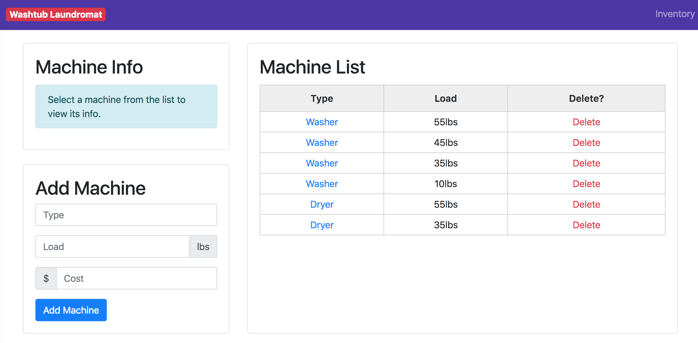
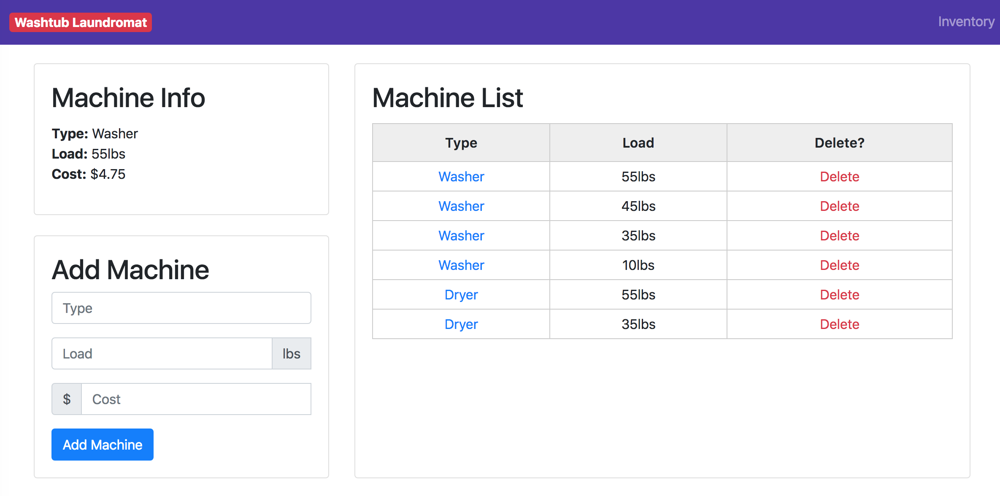
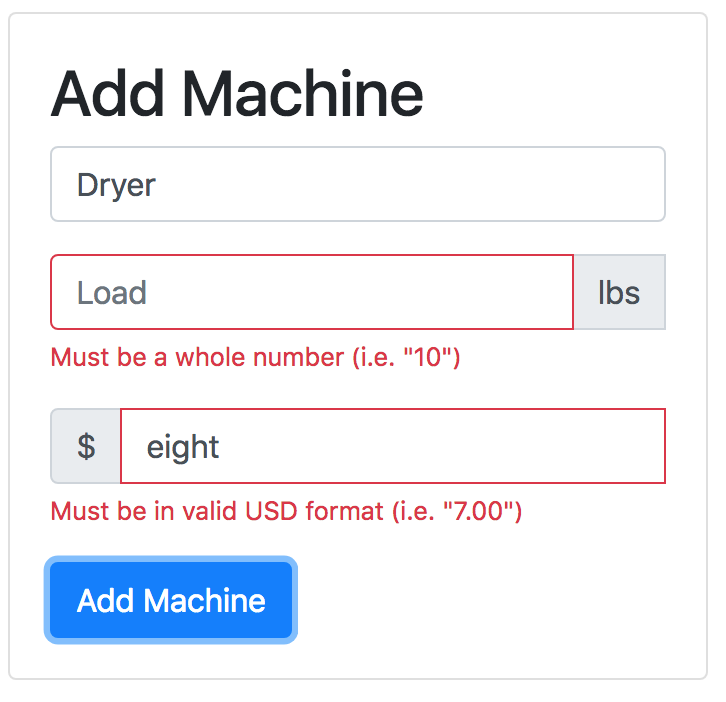

# Washtub Laundromat Machine Inventory

A web application for tracking machine inventory for the Washtub Laundromat. Made with Node.js, Express, React, and Bootstrap. Demonstrates basic REST functionality.

### Prerequirements
* [Node.js](https://nodejs.org/en/download/)
* [Mongodb](https://www.mongodb.org/downloads#production)

### Preparation
* Clone repository
* Start up the Mongodb
  * Create folder ./data in repository root folder
  * run ``` mongod --dbpath ./data ```
* Start up the Express API
  * run ``` npm install ``` in the working directory
  * run ``` npm start ``` 
* Start up the React frontend app
  * ``` cd client/ ``` to navigate to React app, then ``` npm install ```
  * run ``` npm start ``` to get the React Frontend running
* You're up! browse to ``` http://localhost:3000 ``` to see the app in action!
* run ``` npm test ``` to run mocha tests

## Screenshots

Initial view of page, before selecting a machine

Show Machine area fills up after machine is selected

Add machine form catches errors

